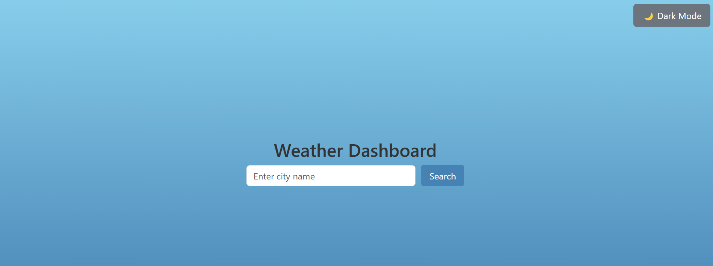
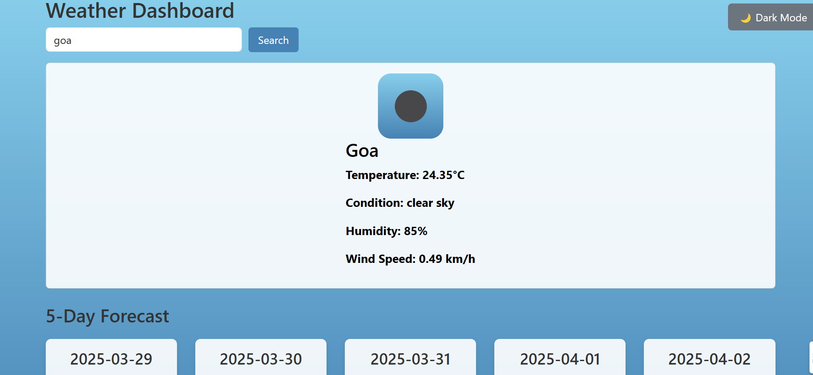
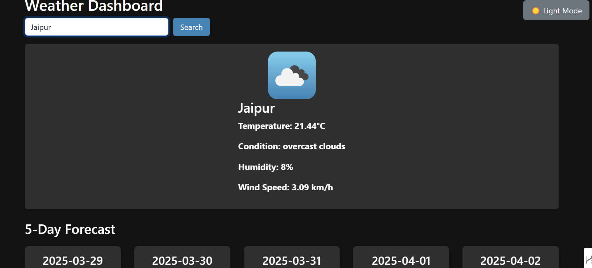
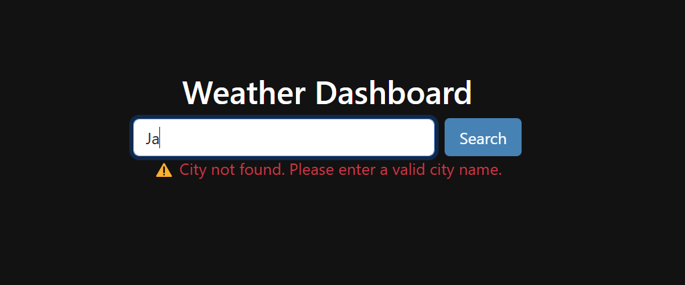

# Weather Dashboard Web App

## Overview
The **Weather Dashboard Web App** is a React-based application that allows users to search for real-time weather updates and a 5-day weather forecast for any city using the OpenWeatherMap API. The app provides a clean and user-friendly interface with error handling, loading indicators, and dynamic background updates.

## Features
- 🌍 **Search Functionality**: Users can search for weather details by entering a city name.
- ☀️ **Current Weather Details**: Displays temperature, weather conditions, humidity, and wind speed.
- 📅 **5-Day Forecast**: Provides a detailed weather forecast for the next five days.
- 🎨 **Light & Dark Mode**: Supports theme toggling between light and dark modes.
- ⚠️ **Error Handling**: Handles invalid city names and API errors gracefully.
- 📡 **API Integration**: Fetches real-time weather data from the OpenWeatherMap API.

## Tech Stack
- **Frontend**: React.js
- **CSS**: Custom styling with light and dark theme support
- **API**: OpenWeatherMap API
- **State Management**: React Hooks (useState)
- **Networking**: Axios

## Installation & Setup
1. **Clone the repository:**
   ```sh
   git clone https://github.com/your-username/weather-dashboard.git
   cd weather-dashboard
   ```
2. **Install dependencies:**
   ```sh
   npm install
   ```
3. **Get an API Key:**
   - Sign up on [OpenWeatherMap](https://openweathermap.org/) and generate an API key.
   - Replace the placeholder in `weatherService.js`:
     ```js
     const API_KEY = "YOUR_API_KEY_HERE";
     ```
4. **Run the app:**
   ```sh
   npm start
   ```
5. **Open in browser:**
   - Navigate to `http://localhost:3000`

## Folder Structure
```
weather-dashboard/
├── public/
├── src/
│   ├── components/
│   │   ├── Home.js
|   |   ├── Home.css
│   ├── services/
│   │   ├── weatherService.js
│   ├── utils/
│   │   ├── processForecast.js
│   ├── styles/
│   │   ├── Home.css
│   ├── App.js
│   ├── index.js
├── package.json
├── README.md
```

## Usage
1. Enter a city name in the search bar and press "Search".
2. View the real-time weather details and 5-day forecast.
3. Toggle between light and dark modes for a better experience.

## Screenshots
# ligt mode



# Dark mode



# when wrong input given


## Deployment
To deploy the project, you can use services like **Vercel** or **Netlify**:
```sh
npm run build
```
Then follow the deployment guide for your chosen platform.

## Future Enhancements
- 🌎 **Geolocation Support**: Automatically fetch the weather of the user's location.
- 🎨 **UI Improvements**: Enhance the UI with animations and better styling.
- 🔔 **Weather Alerts**: Notify users about extreme weather conditions.
- 🌦 **More Forecast Details**: Add hourly weather forecast data.

## License
This project is licensed under the MIT License.

## Contributors
👤 **Raghav Gupta**
- GitHub: [Raghavgupta2003](https://github.com/Raghavgupta2003)
- LinkedIn: [raghav-gupta2003](https://www.linkedin.com/in/raghav-gupta2003/)

